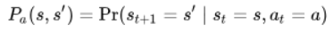
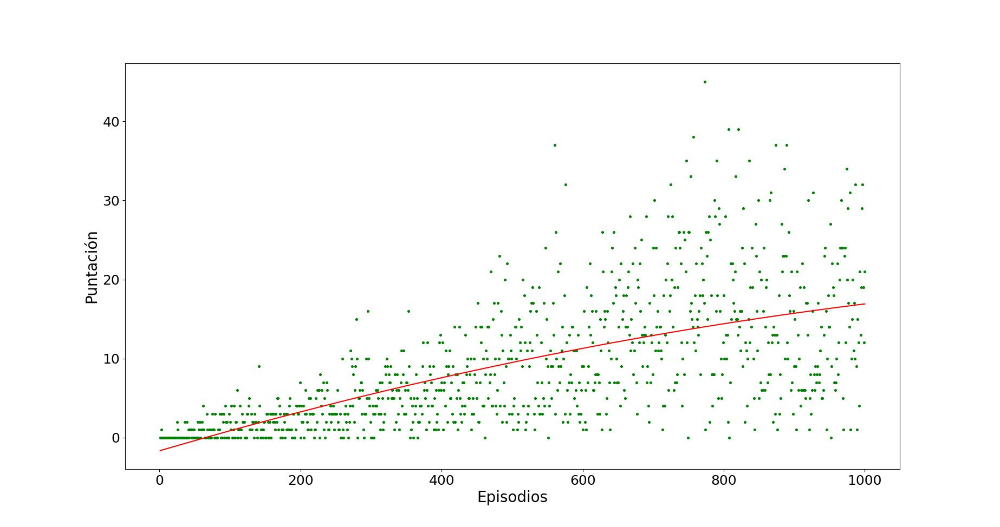
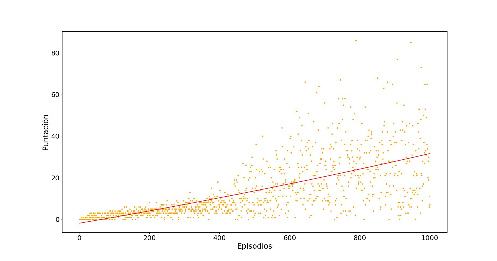
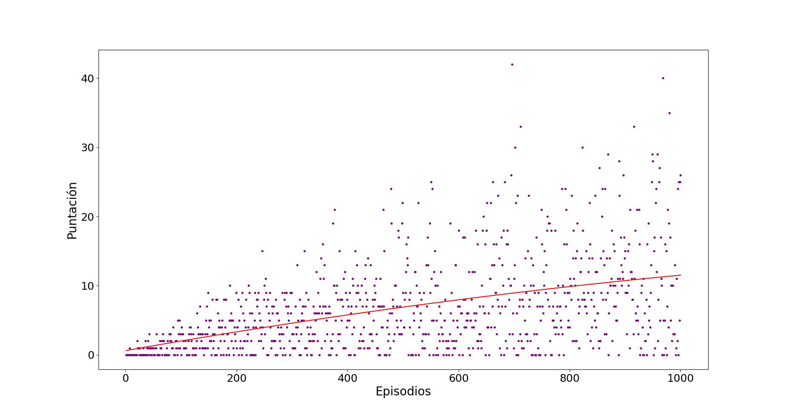
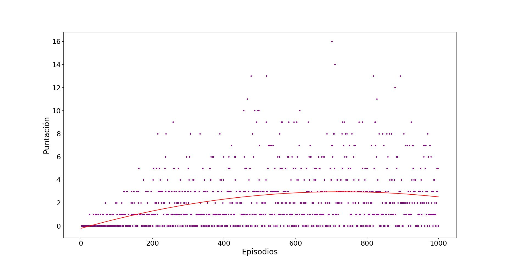

**Snake: Aprendizaje reforzado de un agente basado en Q-learning.**

Carlos Perez Eduardo Perez

**Introducción**

Snake, lanzado en la década de 1970, es un videojuego basado en controlar una serpiente en un plano de 2 dimensiones delimitado, el objetivo del juego es recoger tantos puntos como sea posible evitando golpearse contra las paredes que rodean el juego, o contra su propio cuerpo. Si bien la premisa del juego parece simple a primera vista, la dificultad del mismo aumenta mientras más puntaje se consigue, ya que mientras más puntos recoja la serpiente más largo se hace su cuerpo, por lo que la dificultad de manejar aumenta progresivamente

Al plantearnos esta situación en el ámbito que compete la cátedra nos surgen varias preguntas, ¿Es posible que un agente sea capaz de aprender a jugar este juego? ¿Cuánto tardará en hacerlo? ¿Cómo se adaptará el agente al aumento de la dificultad progresiva del juego? ¿Varía el comportamiento y aprendizaje del agente cambiando el entorno del juego o añadiendo dificultad extra?

En este informe se intentará dar respuesta a estas preguntas con el desarrollo de una versión del juego con un agente entrenado mediante aprendizaje reforzado, específicamente basándonos en el algoritmo de Q-learning, se explicará la implementación diseñada para resolver el problema y a partir de los resultados experimentales se buscará llegar a una conclusión adecuada a las preguntas planteadas

Si bien la implementación de Q-learning es el punto fundamental del trabajo, también se abordará una solución relacionada provista por el artículo Snake Played by a Deep Reinforcement Learning Agent [1], la cual es una variante del Q-learning desarrollada desde la perspectiva del aprendizaje profundo por medio de redes neuronales. Se realizará una comparación de los resultados obtenidos de ambos enfoques con el objetivo de tener una introducción al área del aprendizaje profundo.

**Marco Teórico**

Previo a la implementación de la solución planteada se plasmarán los conceptos teóricos que sirven como base de la solución del problema ya que como se mencionó previamente, el Q-learning no es más que una técnica de aprendizaje reforzado. Empezaremos dando una breve definición de esta área del aprendizaje automático y algunos términos importantes.

- Agente: Un agente en el aprendizaje reforzado es la entidad que se entrena para tomar decisiones correctas. En nuestro caso particular el agente es la serpiente de juego.
- Entorno: El entorno es el escenario con el cual el agente interactúa, es decir la grilla en la que se mueve la serpiente.
- Estado: El estado define la situación en un momento dado del agente.
- Acción: Es la elección que el agente toma en un estado dado del entorno según su posición.
- Política: Es la estrategia de toma de decisiones que el agente, las políticas dictan las acciones que el agente toma en función de su estado y del entorno.

***Aprendizaje Reforzado***

Como su nombre lo indica, el aprendizaje reforzado se basa en el concepto del aprendizaje mediante recompensas, en esta área de estudio la misión del agente es aprender a conseguir estas recompensas en un entorno desconocido. Este concepto de acción y recompensa lleva siendo años estudiado en animales por lo que resulta idóneo planear el juego de ‘snake’ mediante este lente ya que podemos ver claramente qué elementos del juego pueden clasificarse como agente, recompensa y castigo.

En muchos dominios complejos, el aprendizaje reforzado es la mejor solución para entrenar un agente que se desempeñe de la mejor manera posible dadas unas circunstancias específicas, ya que en muchos de estos casos no es posible para un humano proveer una evaluación consistente de todas las acciones que puede tomar un agente en un estado dado. Esta evaluación es provista mediante la prueba y error en la cual al momento de “perder” el juego, el agente mantiene un registro de las acciones que toma y las recompensas que recibe las cuales sirven como guía para futuros episodios del proceso de aprendizaje del mismo, con el objetivo de aprender una politica lo mas optima posible para manejarse en el entorno.

Los algoritmos básicos de aprendizaje reforzado están modelados como un proceso de decisión de Markov, el cual es un es un proceso de control estocástico en tiempo discreto, lo que significa que provee un marco matemático para modelar el proceso de toma de decisiones donde los sucesos de los que se lleva control ocurren en distintos puntos en el tiempo y además el resultado de estos sucesos vienen ligados a un factor aleatorio. Se define el proceso de decisión de Markov como una 4-tupla (S,A,Pa,Ra) donde:

- S es el set de estados
- A es el set de acciones
-  es la probabilidad de una acción **a** en el estado **s** en el tiempo **t** conducirá al estado **s’** en el tiempo **t+1**
-  Es la recompensa inmediata decidida al transicionar del estado **s** al estado **s´**

Volviendo al aprendizaje reforzado, el modelado de este como proceso de decisión de Markov está caracterizado por al desconocimiento de las probabilidades o recompensas, por lo que es útil definir una función que permita inferir cual acción debe ser tomada según la política que se tenga, la cual mediante la experiencia del agente nos provea la “calidad” de una acción en un estado dado, es decir llevar registro de la acción que causa que el agente pase del estado s al estado s´ y el resultado de la misma. Estos registros se guardan en una tabla llamada Q-table y nos introduce al concepto de Q-learning.

***Q-Learning***

El Q-learning es una técnica de aprendizaje reforzado que dado un estado intenta encontrar la siguiente mejor acción basado en un sistema de recompensas que obtiene al interactuar con su entorno. El objetivo del agente es maximizar su recompensa total, esto lo hace sumando la máxima recompensa alcanzable en estados futuros a la recompensa por alcanzar su estado actual. El algoritmo no requiere un modelo de entorno y maneja problemas con transiciones estocásticas.

Elementos importantes:

1. Estados: El estado **S** representa la posición del agente en su entorno.
1. Acción: La acción **A** es el movimiento que realiza el agente en un estado S.
1. Recompensa: Por cada acción el agente recibe una recompensa positiva o negativa.
1. Episodio: Un episodio termina cuando el agente no puede realizar una nueva acción.
1. *Q-value*: Es el valor que determina la calidad de una acción tomada en un estado dado.
1. *Ecuación de Bellman.*

La ecuación de Bellman nos dice la máxima posible futura recompensa que un agente recibe por entrar en un estado actual s sumado a la máxima futura recompensa del siguiente estado s+1

En esta ecuación está basada la ecuación del Q-learning que calcular los Q-values de todos los estados del problema:

La ecuación de Belman es usada para determinar el *Q-value* de un estado particular tomando en cuenta el *Q-value* del estado siguiente. Está compuesta por los siguientes parámetros:

- Tasa de aprendizaje: Determina la velocidad a la que aprende el modelo
- rt: Representa la recompensa recibida de pasar al estado St a St+1.
- Tasa de descuento: Número entre el 0 y 1 que disminuye el impacto del valor Qmax del siguiente estado en relación al *Q-value* del estado actual.

Los *Q-values* calculados con la ecuación de Bellman son almacenados en una tabla llamada Q-table, la cual nos ayuda a llevar registro de los *Q-values* de los estados y sus posibles acciones permitiéndonos así encontrar la mejor acción para cada estado en el entorno.

**Deep Q-learning**

Como se mencionó anteriormente el objetivo secundario del proyecto es comparar la implementación diseñada del algoritmo de Q-learning, con la resolución basada en Deep Q-learning provista por el artículo ya mencionado, por lo tanto estudiaremos superficialmente el marco teórico en el cual está fundamentado en parte debido a que el aprendizaje profundo es una área de estudio muy extensa que sobrepasa los objetivos de la investigación propuesta.

***Deep learning y Redes Neuronales***

El *Deep learning* es una rama del *Machine learning* en la cual se emplean técnicas para que las máquinas aprendan por sí solas, se puede considerar como una forma de automatizar el análisis predictivo. El deep learning funciona mediante el análisis constante de la información que recibe. Para lograrlo, hace uso de redes neuronales artificiales, con el objetivo de que se obtenga un proceso de aprendizaje más avanzado.

Las redes neuronales son un modelo computacional inspirado en el funcionamiento del cerebro humano, consisten en un conjunto de unidades de procesamiento llamadas neuronas artificiales. Estas neuronas reciben valores de entrada mediante conexiones ponderadas, que utilizan para realizar una suma ponderada de ellos, para luego aplicar una función no lineal conocida como la función de activación. El funcionamiento de una neurona artificial se puede ver ilustrado en la siguiente figura:

La cual se expresa matemáticamente con la siguiente fórmula:   =  ( ) , siendo:

- red = w1\*x1 + … + wn\*xn - θ la suma ponderada.
- xi es el valor de la i-ésima variable de entrada.
- wi es el peso de la conexión entre la i-ésima entrada y la neurona, este aumenta o disminuye el impacto que la variable tendrá en los cálculos de la neurona.
- θ es el valor del umbral.
- *o* es la salida de la neurona
- s es la función de activación:

Estas neuronas están interconectadas entre sí en capas ordenadas, donde cada neurona de una capa recibe como entradas las salidas de todas la neuronas de la capa anterior y una vez realicen los cálculos necesarios envía su propia salida a todas las neuronas de la capa siguiente, dichas capas se separan en 3 categorías:

1. **La capa de entrada:** Es la primera capa de la red neuronal, las neuronas que la componen reciben los datos de sus entradas de parte del entorno.
1. **Las capas ocultas:** Son las capas intermedias de la red, una red neuronal puede tener una o muchas capas ocultas, las neuronas de cada capa procesan y refinan los datos de sus entradas en datos cada vez más elaborados, los cuales son enviados a la capa siguiente consiguiendo así información del problema cada vez más compleja.
1. **La capa de salida:** Es la que proporciona la salida final del procesamiento de datos de toda la red. La cantidad de neuronas de esta capa depende de la complejidad de la salida final, si se trata de un problema binario, es decir que su resultado sólo posee 2 valores posibles, la capa solo tendrá una neurona cuya salida será uno de estos 2, de lo contrario si se trata de un problema multiclase, la capa de salida puede estar formada por más de una neurona.

Como cada una de las neuronas aplica una función no lineal a las variables que recibe, se pueden tomar como funciones de múltiples dimensiones donde cada salida de la función es un punto en el plano multidimensional, por lo que cuando se le aplica a dicho plano la función de activación se logran separar los puntos que la activan a los puntos que no lo hacen. De esta manera es que las neuronas procesan múltiples entradas en una sola salida que represente información más compleja.

El objetivo principal de las redes neuronales es aprender a tomar decisiones inteligentes con asistencia humana limitada para resolver problemas con un razonamiento similar al del cerebro humano. Para que esto suceda primero es necesario entrenar la red neuronal, para lo cual existen distintos algoritmos que le permiten a la red modificarse a sí misma durante dicho entrenamiento.

***Deep Q-Learning***

El *Deep Q-learning* es un algoritmo de aprendizaje reforzado que utiliza redes neuronales para aproximar los *Q-values* para cada acción posible en un estado, a diferencia del *Q-learning* el cual utiliza una tabla de valores. La diferencia entre ambos algoritmos se puede ver ilustrada en las siguientes figuras:

*Q-learning Deep Q-learning*

 

Retrieved from: https://www.geeksforgeeks.org/deep-q-learning/

Por lo que durante el entrenamiento en lugar de actualizar constantemente las entradas de una *Q-table* se crea una función de pérdida la cual indica que tanto se ha equivocado la red neuronal al comparar la predicción de los *Q-values* con los *Q-values* objetivo, luego se actualizan los pesos de las conexiones de la red neuronal para mejorar la precisión de dichas predicciones.

Debido a que las redes neuronales aplican funciones no lineales, surge el problema al momento de aproximar las predicciones a los valores deseados, debido a que si solo modificamos los pesos para que la predicción se acerque más al valor óptimo en comparación de dicha predicción , se podria quedar atrapado en un valor mínimo local en lugar de el mínimo global de la función. Esto se puede ver ilustrado en la siguiente figura de una función de 2 dimensiones:

Retrieved from: <https://es.wikipedia.org/wiki/Archivo:Extrema_example_es.svg>

Para esto se utiliza el método de descenso del gradiente. Este método consiste en calcular las derivadas parciales de cada una de las variables de la función para obtener el vector gradiente, el cual siempre apunta en dirección del crecimiento máximo de la función y ajustar la aproximación para que el valor resultante sea cada vez más alejado de dicho crecimiento, pudiendo llegar así a mínimos globales. Si en su lugar se quieren encontrar valores máximos de una función F simplemente se tendrá que aplicar el mismo métodos a la función -F, donde los máximos de F ahora serán los mínimos de -F.

El algoritmo de entrenamiento del Deep Q-learning consiste en 2 etapas:

1. Muestreo: el agente realiza acciones aleatorias por un número determinado de episodios y guarda la información de las experiencias en la memoria.
1. Entrenamiento: Se selecciona aleatoriamente un conjunto de tuplas de dicha memoria y se aprende de dicho conjunto utilizando aproximaciones y predicciones.

**Diseño Experimental**

***Implementación Q-learning***

El snake está implementado utilizando la librería de python: *pygame*, un conjunto de módulos del lenguaje que facilitan el desarrollo de videojuegos en 2 dimensiones. De esta librería se destaca la estructura *Vector2* que permite manejar la posición de todos los elementos del juego implementado, está estructura también es utilizada por los agentes de Q-learning y Deep Q-learning para las interacciones con el juego. Otras librerías utilizadas por ambos agentes son: *numpy* para el manejo de arreglos y *json* para almacenar información del proceso de entrenamiento.

Se implementó el archivo *Qtable.py* que permite inicializar los valores de la *Q-table* que utilizara el agente, en este se definen los estados que tendrá la tabla y las acciones disponibles para el agente. Los estados están definidos por 8 variables:

- La posición de la fruta en relación a la posición de la cabeza de la serpiente en el eje horizontal, sus posibles valores son: **“L”**, **“R”** y **“=”**, que indican si la fruta está a la izquierda, derecha o en la misma posición en el eje X que la cabeza de la serpiente.
- La posición de la fruta en relación a la posición de la cabeza de la serpiente en el eje vertical, sus posibles valores son: **“U”**, **“D”** y **“=”**, que indican si la fruta está arriba, abajo o en la misma posición en el eje Y que la cabeza de la serpiente.
- Las variables 3, 4, 5 y 6 son variables binarias que indican si hay algún peligro directamente a la izquierda, derecha, arriba o abajo de la serpiente respectivamente. Sus posibles valores son 1 y 0.
- La dirección en la que se está moviendo la serpiente, con **“L”**, **“R”**, **“U”** y **“D”** como posibles valores, que representan que la serpiente está apuntando a la izquierda, derecha, arriba o abajo respectivamente.
- La última variable indica si la fruta está adyacente a la cabeza de la serpiente. Sus posibles valores son **“L”**, **“R”**, **“U”**, **“D”** y **“-”** que representan si la fruta está directamente a la izquierda, derecha, arriba o abajo de la serpiente respectivamente, asignando el último valor a los casos en los que la fruta no está adyacente a la serpiente.

Si calculamos todas las permutaciones posibles de estas variables obtendremos el número de estados de la tabla:

3 \* 3 \* 2 \* 2 \* 2 \* 2 \* 4  \* 5 = 2880 

Las acciones que puede realizar el agente son: moverse a la izquierda, derecha, arriba o abajo. Si multiplicamos el número de estados con el número de acciones obtendremos el número de entradas de la *Q-table*:

2880  \* 4  = 11502 

El agente de *Q-learning* está implementado en el archivo *agent\_QL.py.* Para aprender el agente juega al snake cuantas veces indique el número máximo de episodios utilizando la *Q-table* para almacenar el aprendizaje obtenido, reiniciando el juego cada vez que la serpiente muere o llega a 1000 pasos sin comer ninguna fruta. Antes de realizar cada acción en el juego, el agente recopila información del entorno para construir el estado en el que se encuentra y busca los *Q-values* de dicho estado en la tabla, luego realiza ya sea una acción aleatoria o la acción que corresponde al mayor *Q-value* de dicho estado, por último actualiza dicho *Q-value* en base a la recompensa por la acción realizada utilizando la ecuación de Bellman.

***Implementación Deep Q-learning***

El agente de Deep Q-learning está implementado en el archivo *agent\_DQL.py* y se basa principalmente en las funcionalidades que añade la librería de python: *keras*, la cual es una biblioteca de redes neuronales que está especialmente diseñada para posibilitar la experimentación en poco tiempo con redes de aprendizaje profundo.

Para ser compatible con el modelo de la red neuronal implementada, es necesario diseñar estados distintos para este algoritmo ya que no acepta variables cuyos posibles valores son caracteres, se diseñaron estados de información del entorno que solo contengan variables binarias. Dichas variables son:

1. Si la manzana está o no a la izquierda de la cabeza de la serpiente.
1. Si la manzana está o no a la derecha de la cabeza de la serpiente.
1. Si la manzana está o no arriba de la cabeza de la serpiente.
1. Si la manzana está o no abajo de la cabeza de la serpiente.
1. Si hay algún peligro directamente a la izquierda de la serpiente
1. Si hay algún peligro directamente a la derecha de la serpiente
1. Si hay algún peligro directamente arriba de la serpiente
1. Si hay algún peligro directamente abajo de la serpiente
1. Si la serpiente está apuntando a la izquierda.
1. Si la serpiente está apuntando a la derecha.
1. Si la serpiente está apuntando a la arriba.
1. Si la serpiente está apuntando a la izquierda.

Al ser variables binarias los posibles valores de cada una de ellas son el 1 y 0. Esto deja un total de 2¹²  = 4096  , aunque hay muchos estados a los que el agente nunca llegará debido a que hay variables que nunca tendrá valor de 1 en el mismo estado (como las variables que corresponden a la dirección de la serpiente, la cual nunca mirará a la izquierda y arriba al mismo tiempo, por ejemplo).

Las acciones que puede realizar el agente del Deep Q-learning son las mismas que el agente del Q-learning: moverse a la izquierda, derecha, arriba o abajo. La red neuronal artificial está compuesta por 5 capas: la capa de entrada posee 12 nodos, uno por cada variable de los estados lo cual le permite ingresar el estado en el que se encuentre el agente como entrada. Las 3 capas ocultas de procesamiento poseen 128 nodos cada una y la capa de salida que posee 4 nodos, uno por cada acción que puede realizar el agente, la salida de estos nodos son los *Q-*values conseguidos por realizar cada acción cuando el agente se encuentra en el estado de entrada.

***Entrenamiento del agente:***

El entrenamiento consiste de 1000 episodios de aprendizaje para el agente basado en Q-learning para cada una de las variantes de problemas definidos a continuación.

Además, el entrenamiento del agente basado en Deep Q-learning consta de 250 episodios de aprendizaje que se realizará sobre una fracción de los problemas propuestos.

***Tamaño del problema:***

Para probar la capacidad del agente de adaptarse a distintos entornos se desarrolló un conjunto de experimentos que medirán la efectividad del mismo en relación al tamaño de la grilla, los tamaños a explorar son 20x20, 30x30 y 50x50. Se espera que el agente consiga puntajes más altos a mayor tamaño de grilla al tener menos problemas navegando por la misma debido a que podrá evitar su propio cuerpo con mayor facilidad al acercarse a puntajes mayores.

  

20x20 30x30 50x50

***Entorno sin Obstáculos vs Entorno con Obstáculos:***

Se entrenaron versiones del agente en una grilla 30x30 a la cual se le añadieron obstáculos dentro de la misma para comprobar la capacidad del agente de esquivar elementos que no sean el límite del entorno o su propio cuerpo.

Los obstáculos se añaden de manera aleatoria al inicio de la partida, donde cada cuadrado de la grilla tiene un 1%, 2% y 4% de probabilidades de ser un obstáculo según la variante del experimento, los obstáculos se generan siempre y cuando no haya ningún obstáculo ya generado alrededor de él y el cuadrado no sea adyacente con una pared, con el fin de evitar que la fruta quede encerrada en obstáculos y la serpiente no pueda llegar a ella sin morir. Para lograr esto, cada vez que se corre el juego, recorre la grilla cuadro por cuadro y genera un número real aleatorio entre el 0 y el 1, si dicho número es menor a la probabilidad especificada (0.01, 0.02 y 0.04) el programa verifica que no haya ningún obstáculo ya generado alrededor de ese cuadro, si ese es el caso se genera un obstáculo en esa posición.

  

1% de probabilidad 2% de probabilidad 4% de probabilidad

***Agente de control aleatorio vs Q-learning:***

Con el objetivo de comparar la eficiencia del agente entrenado mediante Q-learning se diseñó un agente de control que realiza acciones aleatorias, se realizan 1000 partidas de este agente aleatorio en los distintos tamaños de grillas y se comparan los resultados obtenidos por el agente entrenado.

***Q-learning vs Deep Q-learning:***

Se realizaron comparaciones entre los agentes entrenados mediante Q-learning y Deep Q-learning en los siguientes experimentos, tomando el mismo número de episodios de aprendizaje: Grilla común de 30x30, y entorno con obstáculos con 1%, 2% y 4% de posibilidades de aparición de obstáculo. Esto con el fin de constatar la diferencia entre la capacidad de aprendizaje de los dos algoritmos, se espera que el Deep Q-learning consiga puntajes más altos en los mismos episodios de entrenamiento.

***Métricas de los resultados a analizar:***

Resultados del entrenamiento del agente entrenado a través Q-learning: Para cada experimento diseñado se tomará en cuenta los siguientes valores conseguidos en 1000 episodios de entrenamiento: Puntuación conseguida por episodio, puntuación máxima obtenida durante el entrenamiento, puntuación media obtenida durante el entrenamiento, promedio de cantidad de acciones realizadas por el agente por episodio y la relación entre la cantidad de acciones y la puntuación conseguida

Resultados del entrenamiento del agente entrenado a través de Deep Q-learning: Se tomó en cuenta el puntaje máximo conseguido en 250 episodios de entrenamiento, además de la media de movimientos realizados en los episodios de entrenamiento.

***Ajuste de Parámetros: Entrenamiento sin obstáculos***

- **Tasa de descuento:** 0.95. Se reduce poco el impacto del valor Qmax del siguiente estado porque nos interesa que el agente considere cuáles son las acciones posibles para evitar llegar a un estado que lo lleve a una muerte inevitable.
- **Tasa de aprendizaje:** 0.001. Se utiliza un valor bajo para que los *Q-values* no se vean afectados drásticamente por situaciones atípicas al momento de realizar una acción.
- **Probabilidad de exploración:** 1.0. Al comienzo todos los *Q-values* están inicializados en 0 por lo que se eligen las acciones de manera aleatoria.
- **Tasa de disminución de la probabilidad de exploración:** 0.995. En cada episodio la probabilidad de exploración se reduce un 0.5%. Disminuye de manera lenta para actualizar la mayor cantidad de entradas posibles de la tabla antes de que el agente considere únicamente las acciones óptimas.
- **Recompensa si la cabeza de la serpiente se aleja de la fruta:** -2. Se decidió que el agente perdiera más puntos de recompensa si se aleja de la fruta que lo que gana si se acerca para evitar que el agente se quede atascado moviéndose en círculos para evitar morir.
- **Recompensa si la cabeza de la serpiente se acerca a la fruta:** +1
- **Recompensa si la serpiente se come una fruta:** +10. Se escogió un valor alto para incentivar al agente a ir hacia la fruta pero no lo suficientemente alto como para que morir por comer la fruta sea recomendado.
- **Recompensa si la serpiente muere:** -1000. Para evitar que el agente muera por no perder los puntos que le quitará por alejarse se tomó un valor desproporcionadamente grande para que, en caso de que tenga que elegir entre alejarse de la fruta o chocar contra un obstáculo, el agente se aleje de la fruta.
- **Número de episodios:** 1000.

***Ajuste de Parámetros: Entrenamiento con obstáculos***

- La **Tasa de descuento** y la **Probabilidad de exploración** tienen los mismos valores que en el experimento sin obstáculos.
- **Tasa de aprendizaje:** 0.01. Debido a que chocarse con un obstáculo es una situación típica, se aumentó la tasa de aprendizaje para que el agente aprenda más rápido a lidiar con dichos obstáculos.
- **Tasa de disminución de la probabilidad de exploración:** 0.99. Se aumentó el ritmo al que desciende la probabilidad de exploración para disminuir el número de episodios en los que el agente muere por chocar con un obstáculo gracias a una acción aleatoria.
- **Recompensa si la cabeza de la serpiente se aleja de la fruta:** -1. Como en la grilla hay obstáculos no es recomendable que si el agente prefiere ir hacia la fruta lo más rápido posible, ahora es preferible la situación donde prioriza sobrevivir.
- **Recompensa si la cabeza de la serpiente se acerca a la fruta:** +1
- **Recompensa si la serpiente se come una fruta:** +10. Se escogió un valor alto para incentivar al agente a ir hacia la fruta pero no lo suficientemente alto como para que chocar por comer la fruta sea recomendado.
- **Recompensa si la serpiente muere:** -100. Como el agente ya no pierde más puntos de recompensa alejándose de la fruta de los que gana si se acerca no hace falta tener un valor tan alto.
- **Número de episodios:** 1000.

\*Nota: Los parámetros de entrenamientos del Q-learning y el Deep Q-learning sólo difieren en el número de episodios, siendo 1000 y 250 respectivamente.

**Resultados**

***Resultado del aprendizaje respecto al tamaño del problema:***

En una grilla de 20x20 el agente tiene una tendencia de crecimiento casi lineal hasta los 700 episodios a partir de los cuales se disminuye la pendiente de crecimiento lo que indica que desacelera el aumento de los puntajes obtenidos, esto debido al tamaño reducido del entorno lo que ocasiona que al agente tenga que aprender a manejarse para empezar a evitar su propio cuerpo.

Figura 1. Puntajes conseguidos por episodio en una grilla de 20x20.

Al aumentar el tamaño del entorno, se mantiene el crecimiento lineal de los puntajes obtenidos al pasar los 700 episodios, lo cual significa que a una grilla mayor el agente debe lidiar menos con obstáculos y aprende a evitar mejor las paredes.

Figura 2. Puntajes conseguidos por episodio en una grilla de 30x30.

En una grilla de 50x50 el agente aprende con mayor velocidad a lidiar con la obtención de fruta, al tener más espacio y así lidiar menos con las paredes y su propio cuerpo en comparación con los anteriores experimentos, permitiendo así alcanzar ocasionalmente puntajes más altos que explican el aumento en la dispersión de los puntajes a partir de los 400 episodios.

Figura 3. Puntajes conseguidos por episodio en una grilla de 50x50.

Se compararon los puntajes obtenidos en las grillas de 20x20, 30x30 y 50x50 por el agente aleatorio y los obtenidos por el agente basado en Q-learning en las mismas grillas con el objetivo de contrastar la efectividad del agente implementado. Se observa además que la puntuación máxima del Q-learning aumenta junto con el tamaño del entorno.

Figura 4. Puntajes máximos conseguidos por el agente en distintos tamaños de grilla comparado con los puntajes máximos conseguidos por un agente aleatorio.

De la misma manera se observa que el puntaje promedio del agente basado en Q-learning aumenta con respecto al tamaño del entorno, mientras que el del agente aleatorio disminuye

Figura 5. Puntaje promedio obtenido por el agente en distintos tamaños de grilla comparado con los puntajes promedios obtenidos por un agente aleatorio.

***Resultado del aprendizaje en un entorno con obstáculos:***

***Resultados del Q-learning con 1000 episodios de entrenamiento***

El agente presenta dificultades para aprender cuando debe lidiar con obstáculos antes de aprender a moverse dentro del entorno, lo que ocasiona que termine realizando movimientos que aseguren su supervivencia a los que lo acercan a la fruta. Esto ocasiona que el agente llegue al límite de movimientos máximos, acabando el juego con una puntuación de 0 puntos aún en episodios tardíos del entrenamiento.

Figura 6. Puntajes conseguidos por episodio por el agente en una grilla con una probabilidad de 1% obstáculos aleatorios.

Se observa un comportamiento similar al caso anterior, con la diferencia de que el rango de puntajes se ve reducido con el aumento del número de obstáculos resultando así en un menor puntaje máximo.

Figura 7. Puntajes conseguidos por episodio por el agente en una grilla con una probabilidad de 2% obstáculos aleatorios.

En el caso donde cada casilla tiene un 4% de probabilidades de ser un obstáculo se puede observar que tiende a decrecer en puntaje en los últimos episodios del entrenamiento, a parte del menor puntaje máximo debido al aumento de obstáculos, esto se debe a que el con cada muerte el agente prioriza más la supervivencia por encima de comer la fruta por lo que si bien se observa una menor cantidad de episodios en donde el agente termina con una puntuación de 0, las puntuaciones más altas también van decayendo.

Figura 8. Puntajes conseguidos por episodio por el agente en una grilla con una probabilidad de 4% obstáculos aleatorios.

Como se puede observar, la puntuación máxima obtenida por el agente en un entorno con obstáculos es menor a la conseguida en uno sin obstáculos, reduciendo aún más por cada aumento en el porcentaje de obstáculos. Aun así sigue siendo más efectivo que el aleatorio el cual consiguió una puntuación máxima de 2 con un 1% de obstáculos y 1 en el resto de casos.

Figura 9. Puntuación máxima conseguida por el agente en un entorno con distintos porcentajes de obstáculos comparado con el puntaje máximo del agente aleatorio en las mismas grillas.

En todos los casos el agente presenta una puntuación promedio baja debido al gran número de veces que llegó al límite de acciones máximas sin conseguir una fruta, lo que ocasionó partidas con una puntuación muy baja que redujeron el puntaje promedio considerablemente, esto sumado al hecho de que con mayor probabilidad de obstáculos menor es el puntaje máximo ocasiona que la puntuación promedio se vea reducida con cada aumento de dicha probabilidad.

Figura 10. Puntaje promedio obtenido por el agente en un entorno con distintos porcentajes de obstáculos comparado con el un puntaje promedio del agente aleatorio.

***Resultados del Deep Q-learning con 250 episodios de entrenamiento***

Se compararon los puntajes máximos de ambos agentes en grilla con distintas cantidades de obstáculos con el objetivo de contrastar la eficiencia que presenta el Deep Q-learning ante el Q-learning. Como se puede observar el Deep Q-learning llegó a puntajes mucho más altos que el Q-learning, y aunque ambos disminuyen su eficiencia al aumentar el número de obstáculos, se mantiene una gran diferencia entre ambos.

Figura 11. Puntuación máxima conseguida por el agente de Deep Q-learning en un entorno con distintos porcentajes de obstáculos comparado con el puntaje máximo del agente del Q-learning en las mismas grillas.

***Resultados en base al número de movimientos realizados durante el aprendizaje.***

***Resultados del Q-learning con 1000 episodios de entrenamiento***

Se puede observar que a excepción del experimento con obstáculos, el promedio de los movimientos por episodios aumenta junto con el tamaños del problema debido a mientras mayor sea el tamaño de la grilla, el agente tiene que realizar una mayor cantidad de movimientos para llegar a la fruta y sobrevive por más tiempo al tener más espacio para esquivar los obstáculos. En el caso de la grilla con obstáculos, su bajo rendimiento en comparación a los demás resulta en episodios más cortos y por lo tanto, en menos movimientos por episodio.

Figura 12.Promedio del número de acciones por episodio del agente en las grillas de 20x20, 30x30, 50x50 y 30x30 con obstáculos.

Se observa que la conforme el agente va aprendiendo, el número de movimientos va disminuyendo en relación al número de puntos que consigue por episodio, esto ocurre hasta aproximadamente el episodio 650, donde al alcanzar puntajes más altos el agente requiere una mayor cantidad de movimientos por cada fruta obtenida al intentar esquivar las paredes y su cuerpo.

Figura 13.Relación entre la cantidad de acciones por episodio y la puntuación conseguida por episodio del agente en una grilla 30x30 sin obstáculos.

***Resultados del Deep Q-learning con 250 episodios de entrenamiento***

En el caso del entorno sin obstáculos se puede observar que el *Deep Q-learning* realiza mucho menos movimientos que el *Q-learning* a pesar de conseguir puntajes más altos, esto se debe a que el *Deep Q-learning* toma rutas más cortas para moverse hacia la fruta y realiza una menor cantidad de movimientos aleatorios en los primeros episodios del entrenamiento. La diferencia entre los promedios disminuye en los casos con obstáculos, ambos promedios bajando conforme el número de obstáculos aumenta, pero considerando que el *Deep Q-learning* consigue puntajes más altos, se concluye que este se mueve con mayor eficacia.

Figura 11. Promedio del número de acciones realizadas por el agente de Deep Q-learning en un entorno con distintos porcentajes de obstáculos comparado con el promedio del número de acciones realizadas por del agente del Q-learning en las mismas grillas.

**Conclusiones Finales**

Al inicio del proyecto se plantearon una serie de incógnitas las cuales marcaron el desarrollo del mismo, estas preguntas nos permitieron encarrilar la implementación de un agente el cual a través de ciertas cantidades de episodios de aprendizaje reforzado han conseguido mejorar paulatinamente en el juego de snake, para esto se tomaron dos algoritmos distintos: El Q-learning y el Deep Q-learning.

Con ambos algoritmos el agente fue capaz de aumentar la puntuación del juego entre episodio y episodio, esto bien con marcadas diferencias según el experimento analizado. Si bien el algoritmo de Q-learning consiguió puntuaciones respetables en experimentos donde no había obstáculos aleatorios en el entorno, su desempeño se vio considerablemente reducido al añadirse dichos obstáculos, esto sugiere que el algoritmo presenta limitaciones en su capacidad de aprendizaje cuando el entorno causa la muerte temprana del agente. Por otro lado el algoritmo de Deep Q-learning logró desempeñarse mejor que su contraparte en estos escenarios lo que indica una capacidad de aprendizaje superior la cual le permite superar el problema del agente de lidiar con el entorno en menor cantidad de episodios.

Teniendo en cuenta estas conclusiones podemos desarrollar una nueva serie de preguntas que sería interesante abordar en trabajos futuros, teniendo en cuenta que el mejor desempeño del Q-learning fue cuando no había obstáculos en la grilla más que las paredes de la misma, se podría experimentar con una grilla sin paredes en la que el agente no tenga que preocuparse por las paredes si no que solamente por su propio cuerpo una vez conseguida puntuaciones altas. Además también sería de interés comparar el desempeño del Q-learning con otros algoritmos de aprendizaje reforzado no profundo como el SARSA. Otro aspecto a considerar para futuros experimentos es comparar los tiempos de ejecucioń entre el Q-learning y el Deep Q-learning ya que se observó que el entrenamiento del DQL tomó un tiempo mucho mayor aún con un número menor de episodios por lo que sería interesante considerar las alternativas de entrenamiento que posee el algoritmo de deep learning como por ejemplo el uso de tarjetas gráficas mediante funcionales provistas por la biblioteca keras.

Finalmente debido a restricciones de tiempo y de recursos la cantidad de episodios de DQL fueron reducidas a 250 en comparación con las 1000 del QL, si bien presentó mejores resultados en esos 250 episodios está presente la duda sobre si escalara positivamente al aumentar el número de episodios de entrenamiento o experimentará un plateau en el que los puntajes dejen de mejorar.

En conclusión los resultados experimentales fueron satisfactorios y acorde con las predicciones que teníamos al iniciar el desarrollo del proyecto y las preguntas que surgieron al inicio del mismo fueron aclaradas gracias tanto al marco teórico de la investigación como a las implementaciones desarrolladas para llevar a cabo los experimentos.

**Bibliografía**

1. Snake Played by a Deep Reinforcement Learning Agent [https://towardsdatascience.com/snake-played-by-a-deep-reinforcement-learning-agent-53f2c4 331d36](https://towardsdatascience.com/snake-played-by-a-deep-reinforcement-learning-agent-53f2c4331d36)
1. Understanding the Markov Decision Process (MDP) <https://builtin.com/machine-learning/markov-decision-process>
1. Aprendizaje por refuerzo: algoritmo Q-Learning<http://www.cs.us.es/~fsancho/?e=109>
4. Introducción al aprendizaje por refuerzo. Parte 3: Q-Learning con redes neuronales, algoritmo DQN. [https://markelsanz14.medium.com/introducci%C3%B3n-al-aprendizaje-por-refuerzo-parte-3- q-learning-con-redes-neuronales-algoritmo-dqn-bfe02b37017f](https://markelsanz14.medium.com/introducci%C3%B3n-al-aprendizaje-por-refuerzo-parte-3-q-learning-con-redes-neuronales-algoritmo-dqn-bfe02b37017f)
4. What Is Q-Learning: The Best Guide To Understand Q-Learning <https://www.simplilearn.com/tutorials/machine-learning-tutorial/what-is-q-learning>
4. Teaching a computer how to play Snake with Q-Learning [https://towardsdatascience.com/teaching-a-computer-how-to-play-snake-with-q-learning-93d0 a316ddc0](https://towardsdatascience.com/teaching-a-computer-how-to-play-snake-with-q-learning-93d0a316ddc0)
4. A gentle introduction to Reinforcement Learning [https://aamrani1999.medium.com/a-gentle-introduction-to-reinforcement-learning-d26cba645 5f7](https://aamrani1999.medium.com/a-gentle-introduction-to-reinforcement-learning-d26cba6455f7)
4. Q-Learning Algorithm: From Explanation to Implementation [https://towardsdatascience.com/q-learning-algorithm-from-explanation-to-implementation-cd beda2ea187](https://towardsdatascience.com/q-learning-algorithm-from-explanation-to-implementation-cdbeda2ea187)
4. What Is Q-Learning: The Best Guide To Understand Q-Learning <https://www.simplilearn.com/tutorials/machine-learning-tutorial/what-is-q-learning>
4. AI Driven Snake Game using Deep Q-Learning <https://www.geeksforgeeks.org/ai-driven-snake-game-using-deep-q-learning/>
4. Exploration of Reinforcement Learning to SNAKE <http://cs229.stanford.edu/proj2016spr/report/060.pdf>
4. Neurona de McCulloch-Pitts<https://es.wikipedia.org/wiki/Neurona_de_McCulloch-Pitts>
13. Red neuronal artificial<https://es.wikipedia.org/wiki/Red_neuronal_artificial>
14. ¿Qué es una red neuronal? [https://aws.amazon.com/es/what-is/neural-network/#:~:text=Una%20red%20neuronal%20es %20un,lo%20hace%20el%20cerebro%20humano](https://aws.amazon.com/es/what-is/neural-network/#:~:text=Una%20red%20neuronal%20es%20un,lo%20hace%20el%20cerebro%20humano).
14. About Pygame<https://www.pygame.org/wiki/about>
16. Keras<https://es.wikipedia.org/wiki/Keras>
17. The Deep Q-Learning Algorithm <https://huggingface.co/learn/deep-rl-course/unit3/deep-q-algorithm?fw=pt>
17. Deep Q-Learning<https://www.geeksforgeeks.org/deep-q-learning/>
19. Deep learning<https://en.wikipedia.org/wiki/Deep_learning>
20. Función de pérdida vs función de activación <https://keepcoding.io/blog/funcion-de-perdida-vs-funcion-de-activacion/>
20. Descenso de gradiente [https://es.khanacademy.org/math/multivariable-calculus/applications-of-multivariable-derivati ves/optimizing-multivariable-functions/a/what-is-gradient-descent](https://es.khanacademy.org/math/multivariable-calculus/applications-of-multivariable-derivatives/optimizing-multivariable-functions/a/what-is-gradient-descent)
20. Russel, Stuart. Norvig, Peter. Artificial Intelligence: A Modern Approach. 3era edición, Pearson, 2009.
